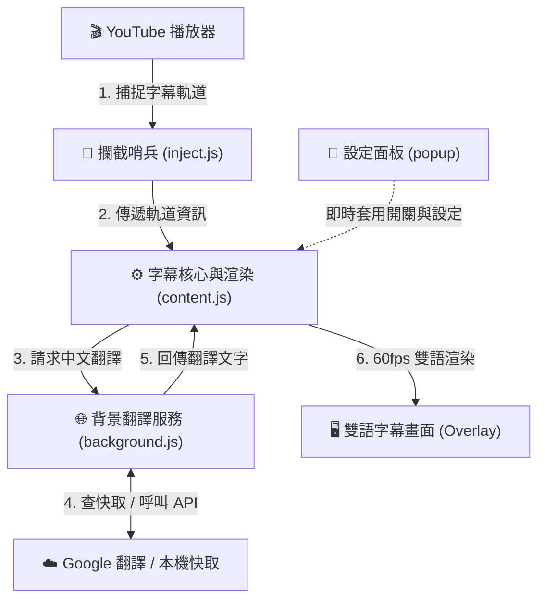
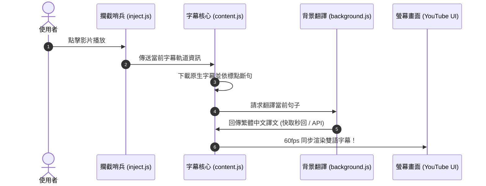

# YouTube 雙語字幕與即時選詞翻譯
## 系統架構與資料流說明 (System Architecture & Data Flow)

---

## 1. 簡約系統架構圖 (System Architecture)

本擴充功能採用經典的 **4 層職責分離架構**，模組間單向傳遞，結構清晰解耦：

---

## 2. 核心資料流時序圖 (Data Flow Sequence)

由影片載入到畫面呈現，僅需極簡的 **5 個標準步驟**：

---

## 3. 模組職責快速對照

| 檔案 | 扮演角色 | 核心工作（一句話說明） |
| :--- | :--- | :--- |
| **`inject.js`** | 攔截哨兵 | 負責從 YouTube 原生播放器提取字幕網址與換片事件。 |
| **`content.js`** | 核心大腦 | 負責字幕斷句、時間軸對齊、60fps 畫面渲染與快捷鍵。 |
| **`background.js`** | 翻譯中繼站 | 負責快取管理、Google 翻譯 API 請求與 2.5 秒超時保護。 |
| **`styles.css`** | 視覺外觀 | 定義雙語字幕排版、動態字級、毛玻璃視窗與警告樣式。 |
| **`popup.html / .js`** | 控制遙控器 | 提供總開關、語言切換、字級大小與時間微調設定。 |
