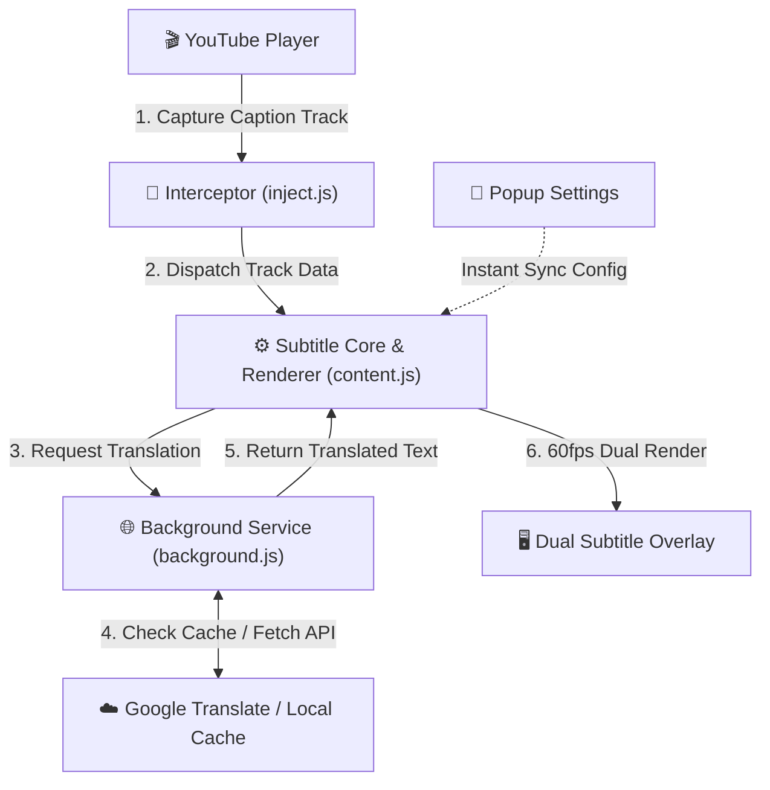

# 🎬 YouTube Dual Subtitles & Quick Translate

<p align="center">
  <b>English</b> | <a href="./README.zh-TW.md">繁體中文</a>
</p>

<p align="center">
  
  
  
  
</p>

A high-performance, zero-delay, and privacy-first **YouTube Dual Subtitles & Instant Vocabulary Translation Chrome Extension** built for language learners, creators, and international viewers.

Engineered on the modern **Chrome Manifest V3** standard, featuring 60fps frame synchronization, smart punctuation sentence merging, sliding-window preloaded translation, multi-endpoint timeout rotation, audio snippet playback, and keyboard shortcut navigation.

---

## ✨ Key Features

* ⚡ **60fps Frame Synchronization (Zero-Delay Sync)**:
  * Replaces low-frequency `video.timeupdate` with `requestAnimationFrame` loops (16.6ms precision), eliminating the standard 250ms subtitle lag.
* 🧠 **Smart Sentence Merging & Intra-Segment Split**:
  * Automatically aggregates fragmented ASR words into coherent, grammatical sentences.
  * Enforces strict punctuation boundary rules (`.`, `?`, `!`, `。`, `？`, `！`) to **prevent sentence overflow or trailing overlaps**.
* 🚀 **First-Sentence Instant Fast Lane**:
  * On video load or timeline seeking, prioritizes the immediate sentence to deliver translations in **80ms ~ 120ms**, eliminating "Translating..." waiting states.
* 🛡️ **2.5s Timeout Circuit Breaker & 3-Tier Endpoint Rotation**:
  * Integrates 3 official Google GTX translation endpoints with an automatic `AbortController` (2.5s timeout). Gracefully recovers from HTTP 429 rate limits without freezing.
* 💾 **3,000-Entry Persistent LRU Cache**:
  * Synced to `chrome.storage.local` to survive Service Worker idle restarts. Rewatching videos requires **zero duplicate API requests**.
* 🔍 **Selection Tooltip & Native Video Audio Playback**:
  * Highlight any subtitle text to view instant translations in a glassmorphic tooltip.
  * Click **"🎬 Play Snippet"** to replay the exact slice of the speaker's original audio from the video, or **"🗣️ Speak"** via TTS.
  * Isolated event propagation prevents conflicts with third-party translation popups.
* 📱 **YouTube Shorts Vertical Layout Adaptation**:
  * Automatically detects Shorts players and dynamically adjusts layout (`bottom: 125px`) to avoid covering titles and interaction buttons.
* 🎨 **Dynamic 4-Tier Scaling & Master Toggle**:
  * Offers Small, Medium, Large, and Extra Large scaling options with synchronized subtitle and tooltip dimensions.
  * Features an iOS-style Master On/Off switch in the popup for instant enabling/disabling.

---

## ⚡ Keyboard Shortcuts Cheatsheet

Control your playback and practice shadowing effortlessly while watching any YouTube video:

| Shortcut | Action | Description |
| :---: | :---: | :--- |
| <kbd>R</kbd> | **Replay Sentence** | Replays the speaker's original audio snippet for the current sentence and pauses automatically. |
| <kbd>A</kbd> | **Previous Sentence** | Jumps playback to the start of the previous subtitle sentence. |
| <kbd>D</kbd> | **Next Sentence** | Jumps playback to the start of the next subtitle sentence. |

*(Note: Shortcuts automatically yield when typing in comments, search bars, or input fields.)*

---

## 📥 Installation

### Method 1: Load Unpacked (Local Developer Mode)

1. Download or clone this repository:
   ```bash
   git clone https://github.com/21317389/youtube-dual-subtitles.git
   ```
2. Open Google Chrome and navigate to:
   ```text
   chrome://extensions/
   ```
3. Enable **"Developer mode"** in the top-right corner.
4. Click **"Load unpacked"** in the top-left corner.
5. Select the project directory to install!

### Method 2: Chrome Web Store (Coming Soon)
* Direct installation link will be provided here upon review approval.

---

## 🏗️ Architecture Overview

The extension adopts a decoupled **4-Tier Unidirectional Architecture**. Detailed technical specifications can be found in [ARCHITECTURE.md](ARCHITECTURE.md):



---

## 🔒 Privacy & Security

* **Zero Data Collection**: No user credentials, cookies, viewing history, or personal data are collected or transmitted.
* **Minimal Permissions**: Only requests `storage` to preserve user preferences and local translation cache.
* **No Remote Scripts**: 100% compliant with Chrome Manifest V3 security standards. All scripts are packaged locally.

---

## 📄 License

This project is open-source under the [MIT License](LICENSE). Contributions, bug reports, and pull requests are welcome!
