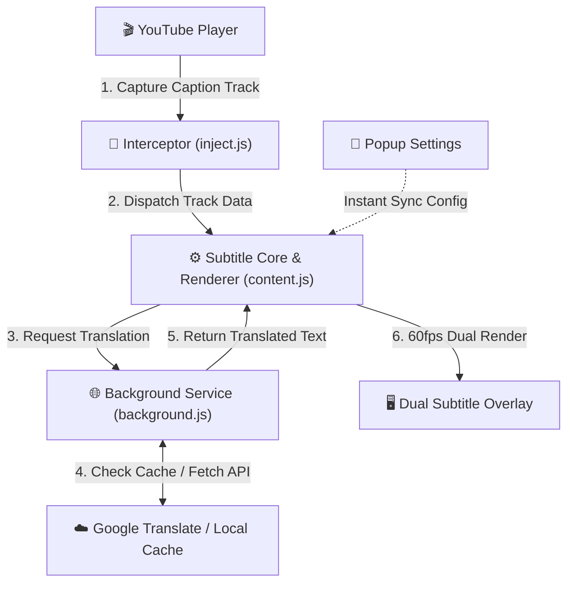

# 🎬 YouTube Dual Subtitles & Quick Translate

<p align="center">
  <b>English</b> | <a href="./README.zh-TW.md">繁體中文</a>
</p>

<p align="center">
  <a href="https://chromewebstore.google.com/detail/mjegnldlpifcepbeepojcbimgdbdilig"></a>
  
  
  
</p>

<p align="center">
  👉 <b><a href="https://chromewebstore.google.com/detail/mjegnldlpifcepbeepojcbimgdbdilig">Install from Chrome Web Store (100% Free — Compatible with Chrome, Edge, Brave & Arc)</a></b>
</p>

A high-performance, zero-delay, and privacy-first **Dual-Track YouTube Dual Subtitles & Instant Vocabulary Translation Chrome Extension** built for language learners, creators, and international viewers.

Looking for the **best free YouTube dual subtitles extension** without registration or API keys, or a **lightweight alternative to Immersive Translate and Language Reactor** specifically engineered for YouTube? This extension delivers flicker-free bilingual captions, hover dictionary lookup, and original speaker audio replay for shadowing practice.

---

## 📊 Why Choose This Extension? (Comparison)

| Feature | YouTube Dual Subtitles (This Extension) | General Web Translators (e.g., Immersive Translate) | Heavy Learning Suites (e.g., Language Reactor) |
| :--- | :--- | :--- | :--- |
| **Focus & Footprint** | **Purpose-built for YouTube; ultra-lightweight & zero bloat** | Full-page web translator; heavier script footprint | Complex UI that alters YouTube's native player layout |
| **Auto-Captions (ASR) Stability** | **Dual-Slot Sentence Engine locks previous sentence & prevents line jumping** | Often flickers or jumps as YouTube rolls word-by-word | Struggles with unpunctuated live ASR streams |
| **Respects Native `CC` Toggle** | **Only activates when YouTube `CC` is ON; restores native CC when toggled OFF** | Often forces captions on every video indiscriminately | Overrides native player controls |
| **Word Lookup + Original Audio Replay** | **Built-in selection dictionary + 1-click speaker audio snippet replay** | Text translation only; no video audio slice replay | Requires sidebars or paid Pro tier |
| **YouTube Shorts Support** | **Native vertical layout adaptation for YouTube Shorts** | Often overlaps Shorts titles or fails to trigger | Limited Shorts compatibility |
| **Cost & Account Requirement** | **100% Free & Open Source — No account, no API key required** | Advanced translation requires subscription or API key | Pro features locked behind monthly subscription |

---

## ✨ Key Features

* 🌟 **Dual-Track Smart Routing**:
  * **Track 1 (Traditional Static Subtitles)**: Batch full-sentence pre-translation, 60fps binary-search frame sync, zero-latency seeking.
  * **Track 2 (Gemini ASR Live Streaming)**: World's first "Sentence-Driven Dual-Slot Rolling Engine" — Slot 1 securely holds the previous complete sentence (Original + Translation in a 0.65 contrast capsule), while Slot 2 streams real-time word-by-word token extension without line jumping or race condition corruption.
* 🎯 **Non-Intrusive Native `CC` Integration**:
  * Never forces subtitles onto videos where you don't want them. Dual subtitles render only when both YouTube's native `CC` button and the extension switch are ON, and seamlessly restore native YouTube captions when turned OFF.
* ⚡ **60fps Frame Synchronization (Zero-Delay Sync)**:
  * Replaces low-frequency `video.timeupdate` with `requestAnimationFrame` loops (16.6ms precision), eliminating the standard 250ms subtitle lag.
* 🧠 **Smart Sentence Merging & Intra-Segment Split**:
  * Automatically aggregates fragmented ASR words into coherent, grammatical sentences.
  * Enforces strict punctuation boundary rules (`.`, `?`, `!`, `。`, `？`, `！`) to **prevent sentence overflow or trailing overlaps**.
* 🧹 **YouTube Native Noise & Laughter Filter (ASR Noise Cleaner)**:
  * Automatically purges `>>`, `>>>`, `&gt;&gt;` (speaker changes/laughter markers) along with `[Laughter]`, `[Music]`, `[Applause]` notes for a distraction-free view.
* 🚀 **First-Sentence Instant Fast Lane**:
  * On video load or timeline seeking, prioritizes the immediate sentence to deliver translations in **80ms ~ 120ms**, eliminating "Translating..." waiting states.
* 🛡️ **2.5s Timeout Circuit Breaker & 3-Tier Endpoint Rotation**:
  * Integrates 3 official Google GTX translation endpoints with an automatic `AbortController` (2.5s timeout). Gracefully recovers from HTTP 429 rate limits without freezing.
* 💾 **3,000-Entry Persistent LRU Cache**:
  * Synced to `chrome.storage.local` to survive Service Worker idle restarts. Rewatching videos requires **zero duplicate API requests**.
* 🔍 **Selection Tooltip & Native Video Audio Playback**:
  * Highlight any subtitle text to view instant translations in a glassmorphic tooltip.
  * Click **"🎬 Play Snippet"** to replay the exact slice of the speaker's original audio from the video, or **"🗣️ Speak"** via TTS.
  * Isolated event propagation prevents conflicts with third-party translation popups.
* 📱 **YouTube Shorts Vertical Layout Adaptation**:
  * Automatically detects Shorts players and dynamically adjusts layout (`bottom: 125px`) to avoid covering titles and interaction buttons.
* 🎨 **Dynamic 4-Tier Scaling & Master Toggle**:
  * Offers Small, Medium, Large, and Extra Large scaling options with synchronized subtitle and tooltip dimensions.
  * Features an iOS-style Master On/Off switch in the popup for instant enabling/disabling.

---

## 📖 User Guide (How to Use)

### 1. Enable Bilingual Subtitles
1. Open any YouTube video or YouTube Shorts.
2. Click the **"CC" Subtitle Button** on the YouTube video control bar (or press keyboard shortcut <kbd>C</kbd>).
3. The extension automatically detects the video stream type:
   * **Standard Video**: Loads static full-video cues with batch pre-translation.
   * **Live / Gemini ASR Stream**: Automatically activates the real-time Dual-Slot Rolling Engine.
4. Turning off the extension switch in the toolbar popup immediately restores YouTube's native single-language CC captions.

### 2. Reading the Dual-Slot Display
* **Slot 1 (Upper Slot)**: Securely displays the **previous complete finished sentence** (Original + Translation in high-contrast 0.65 black capsule background).
* **Slot 2 (Lower Slot)**: Actively displays the **current spoken sentence** extending smoothly word-by-word, and seamlessly promotes to Slot 1 once a sentence-ending punctuation is encountered.

### 3. Word Lookup & Audio Snippet Replay
1. Highlight any word or phrase on the subtitles with your mouse cursor.
2. A glassmorphic dictionary tooltip pops up immediately displaying the definition.
3. Click **"🎬 Play Snippet"**: The player rewinds and precisely replays the speaker's original voice slice from the video!
4. Click **"🗣️ Speak"**: Reads the word aloud via speech synthesis.

### 4. Popup Panel Configuration
Click the extension icon in your browser toolbar to customize:
* **Master On/Off Switch**: iOS-style toggle to turn dual subtitles on or off instantly.
* **Target Language**: Choose Traditional Chinese (zh-TW), Simplified Chinese (zh-CN), English (en), Japanese (ja), Korean (ko), Spanish (es), French (fr), German (de), Vietnamese (vi), or Thai (th).
* **Font Size**: Small (85%), Medium (100%), Large (115%), Extra Large (130%) with synchronized tooltip scaling.

---

## ⚡ Keyboard Shortcuts Cheatsheet

Control your playback and practice shadowing effortlessly while watching any YouTube video:

| Shortcut | Action | Description |
| :---: | :---: | :--- |
| <kbd>R</kbd> | **Replay Sentence** | Replays the speaker's original audio snippet for the current sentence and pauses automatically. |
| <kbd>A</kbd> | **Previous Sentence** | Jumps playback to the start of the previous subtitle sentence. |
| <kbd>D</kbd> | **Next Sentence** | Jumps playback to the start of the next subtitle sentence. |

*(Note: Shortcuts automatically yield when typing in comments, search bars, or input fields.)*

---

## 📥 Installation

### Method 1: Chrome Web Store (Recommended — 1-Click Install)
* 👉 **[Install YouTube Dual Subtitles & Bilingual Translate on Chrome Web Store](https://chromewebstore.google.com/detail/mjegnldlpifcepbeepojcbimgdbdilig)**

### Method 2: Load Unpacked (Local Developer Mode)

1. Download or clone this repository:
   ```bash
   git clone https://github.com/21317389/youtube-dual-subtitles.git
   ```
2. Open Google Chrome and navigate to `chrome://extensions/`.
3. Enable **"Developer mode"** in the top-right corner.
4. Click **"Load unpacked"** in the top-left corner and select the project directory.

---

## ❓ Frequently Asked Questions (FAQ)

### Q1: Why don't subtitles appear automatically when I open a video?
To avoid interrupting you on music videos or native-language content, this extension respects your YouTube player's **CC button**. Simply click the **CC** button on the YouTube player (or press <kbd>C</kbd>) whenever you want dual subtitles!

### Q2: How does this stop YouTube auto-generated captions (ASR) from jumping and flickering?
Standard extensions translate raw 2-line rolling fragments directly, causing constant layout jumps. Our **Dual-Slot Sentence Engine** merges fragments into complete grammatical sentences, locking the finished sentence in the upper slot while smoothly extending the active sentence in the lower slot.

### Q3: Is this a free alternative to Language Reactor or Immersive Translate for YouTube?
Yes. If you want clean bilingual subtitles, instant word lookup, and audio snippet replay for shadowing on YouTube without heavy page modifications, account sign-ups, or paid API keys, this extension is purpose-built for you.

---

## 🏗️ Architecture Overview

The extension adopts a decoupled **4-Tier Unidirectional Architecture**. Detailed technical specifications can be found in [ARCHITECTURE.md](ARCHITECTURE.md):


```mermaid
flowchart TD
    A["🎬 YouTube Player"] -->|"1. Capture Caption Track"| B["📄 Interceptor (inject.js)"]
    B -->|"2. Dispatch Track Data"| C["⚙️ Subtitle Core & Renderer (content.js)"]
    C -->|"3. Request Translation"| D["🌐 Background Service (background.js)"]
    D <-->|"4. Check Cache / Fetch API"| E["☁️ Google Translate / Local Cache"]
    D -->|"5. Return Translated Text"| C
    C -->|"6. 60fps Dual Render"| F["🖥️ Dual Subtitle Overlay"]
    
    G["🎨 Popup Settings"] -.->|"Instant Sync Config"| C
```

---

## 🔒 Privacy & Security

* **Zero Personal Data Collection**: No user credentials, cookies, viewing history, or personal data are collected or transmitted.
* **Minimal Permissions**: Only requests `storage` to preserve user preferences and local translation cache.
* **No Remote Scripts**: 100% compliant with Chrome Manifest V3 security standards. All scripts are packaged locally.

---

## 📄 License

This project is open-source under the [MIT License](LICENSE). Contributions, bug reports, and pull requests are welcome!

