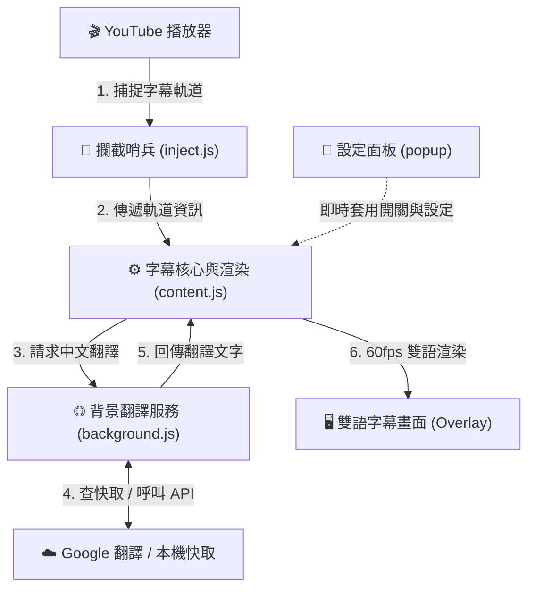

# 🎬 YouTube Dual Subtitles & Quick Translate

<p align="center">
  <a href="./README.md">English</a> | <b>繁體中文</b>
</p>

<p align="center">
  
  
  
  
</p>

一款專為語言學習者、影音內容創作者與跨國資訊汲取者打造的 **高純淨、零延遲、雙軌智慧分流 YouTube 雙語字幕與即時選詞翻譯 Chrome 擴充功能**。

基於最新 **Chrome Manifest V3** 規範開發，具備 60fps 動畫幀同步、句級對稱雙槽即時滾動、智慧標點斷句、滑動窗口動態翻譯、多端點超時輪替、原聲片段重播與熱鍵操控等全方位學習功能。

---

## ✨ 核心特色 (Key Features)

* 🌟 **雙軌智慧自動分流（Dual-Track Smart Routing）**：
  * **軌道一（傳統靜態字幕）**：批次全句預翻譯、60fps 二分搜尋幀循環極速同步，隨點隨跳進度條零延遲。
  * **軌道二（Gemini ASR 即時串流）**：首創「句級對稱雙槽滾動引擎」——上槽永久鎖定上一句完結長句（英+中），下槽實時逐字吐字延伸，句末第 0ms 同步推升，0 競態、0 覆蓋縮水、0 粘連重複。
* ⚡ **60fps 動畫幀同步（Zero-Delay Sync）**：
  * 拋棄低頻的 `video.timeupdate`，採用 `requestAnimationFrame` 迴圈以 16.6ms 精度即時比對，徹底消除傳統擴充功能 250ms 的字幕落後延遲。
* 🧠 **智慧合句與段內標點拆解（Smart Sentence Merging）**：
  * 自動將 YouTube ASR 破碎短詞聚合成語意通順的完整句子。
  * 內建嚴格句號/標點斷句規則，**絕不發生多句沾黏與跨句溢出**。
* 🧹 **YouTube 原生音效與笑聲清洗（ASR Noise Filter）**：
  * 自動過濾 `>>`、`>>>`、`&gt;&gt;`（笑聲/講者切換標記）及 `[Laughter]`、`[Music]`、`[Applause]` 等無效註釋，保持畫面極致純淨。
* 🚀 **首句極速優先通道（Instant Fast Lane）**：
  * 影片開播或隨意拖曳進度條（Seek）時，第一時間在 **80ms ~ 120ms 內秒開翻譯**，杜絕「翻譯中...」的卡頓等待感。
* 🛡️ **2.5 秒超時熔斷與三端點輪替（Endpoint Rotation & Fallback）**：
  * 內建 3 組官方純淨 GTX 翻譯端點，遇 HTTP 429 或網路逾時自動在 2.5 秒內強制熔斷並無感切換備用端點。
* 💾 **3,000 筆持久化 LRU 快取（Persistent Storage Cache）**：
  * 同步儲存於 `chrome.storage.local`，即使 Service Worker 進入休眠重啟，看過的字幕永遠無需重複發送翻譯請求。
* 🔍 **反白即查詞 & 影片原聲重播（Selection Tooltip & Audio Snippet）**：
  * 滑鼠反白字幕單字即可查看繁體中文釋義。
  * 內建「🎬 聽原聲」可精準截取該單詞在影片中的原始語音切片重播，並支援「🗣️ 朗讀」。
  * 阻斷事件冒泡，杜絕與第三方翻譯擴充功能彈窗打架。
* 📱 **YouTube Shorts 短影音垂直自適應**：
  * 自動偵測 Shorts 播放器並調整垂直間距（`bottom: 125px`），完美避開標題與互動按鈕。
* 🎨 **動態 4 級字級與總開關**：
  * 支援「小型、標準、大型、特大」，字幕與選詞 Tooltip 視窗即時按比例連動縮放。

---

## 📖 使用說明 (User Guide)

### 1. 啟用雙語字幕
1. 打開任意 YouTube 影片或 YouTube Shorts。
2. 點擊 YouTube 播放器控制列右下角的 **「CC」字幕按鈕**（或按下鍵盤快速鍵 <kbd>C</kbd>）。
3. 擴充功能將會**自動識別影片類型**：
   * **傳統影片**：自動載入全片字幕並啟用批次高速翻譯。
   * **即時 ASR / Gemini 串流影片**：自動啟動「句級雙槽雙語滾動引擎」。

### 2. 閱讀雙槽字幕
* **上槽 (Slot 1)**：上一句已講完的**完整長句**（英文 + 繁體中文譯文，搭配 0.65 半透明黑膠囊底色背景，層次分明）。
* **下槽 (Slot 2)**：講者**當前正在講的句子**（英文字幕在同一個膠囊內實時逐字吐字延伸，遇到句末標點符號完結時平滑推升至上槽）。

### 3. 反白查詞與聽原聲發音
1. 用滑鼠直接在字幕上**反白選取任意生詞或片語**。
2. 畫面會立即彈出磨砂玻璃質感的釋義浮窗，顯示單字釋義。
3. 點擊 **「🎬 聽原聲」**：播放器會自動倒帶並精準截取影片中講者說出該單詞的原聲切片進行重播！
4. 點擊 **「🗣️ 朗讀」**：使用瀏覽器標準語音合成發音。

### 4. 設定面板操作
點擊瀏覽器右上角擴充功能圖示，可自訂：
* **啟用雙語字幕**：總開關（iOS 風格平滑切換）。
* **目標翻譯語言**：支援繁體中文 (zh-TW)、簡體中文 (zh-CN)、日文 (ja)、韓文 (ko)、西班牙文 (es) 等多國語言。
* **字幕字級**：小型 (85%)、標準 (100%)、大型 (115%)、特大 (130%)，字幕與查詞浮窗即時按比例縮放。

---

## ⚡ 鍵盤快捷鍵 (Shortcuts Cheatsheet)

在播放 YouTube 影片時，可直接透過以下熱鍵實現極速跟讀與聽力訓練：

| 快捷鍵 | 功能描述 |
| :---: | :--- |
| <kbd>R</kbd> | **重播當前句子影片原聲**（精準截取該句時間戳記播放，結束後自動暫停） |
| <kbd>A</kbd> | **跳至上一句字幕**（影片時間軸同步跳轉至上一句開頭） |
| <kbd>D</kbd> | **跳至下一句字幕**（影片時間軸同步跳轉至下一句開頭） |

*(註：當游標處於留言輸入框或搜尋列時，熱鍵會自動避讓，不影響正常打字。)*

---

## 📥 安裝指南 (Installation)

### 方式一：透過開發者模式載入（本地安裝）

1. 點擊本專案右上角 `Code` -> `Download ZIP` 並解壓縮（或使用 `git clone`）。
2. 開啟 Google Chrome 瀏覽器，在網址列輸入：
   ```text
   chrome://extensions/
   ```
3. 開啟右上角的 **「開發者模式 (Developer mode)」**。
4. 點擊左上角的 **「載入未封裝項目 (Load unpacked)」**。
5. 選擇本專案資料夾即可完成安裝！

### 方式二：Chrome Web Store（即將上架）
* 審查通過後將在此提供官方商店一鍵安裝連結。

---

## 🏗️ 系統架構圖 (Architecture Overview)

本專案採用解耦的 **4 層職責分離架構**，詳細技術規格可參閱 [ARCHITECTURE.md](ARCHITECTURE.md)：



---

## 🔒 隱私與安全聲明 (Privacy & Security)

* **零個人資料收集**：本擴充功能不收集、不記錄、不傳輸任何使用者的個人隱私、帳號、Cookie 或瀏覽紀錄。
* **權限最小化**：僅申請 `storage` 權限用於記錄您的字級偏好與本機翻譯快取。
* **無外部動態腳本**：100% 符合 Chrome Manifest V3 安全政策，所有程式碼均在本地離線打包。

---

## 📄 開源授權 (License)

本專案採用 [MIT License](LICENSE) 開源授權，歡迎自由學習、修改或提交 PR 共同改進！
